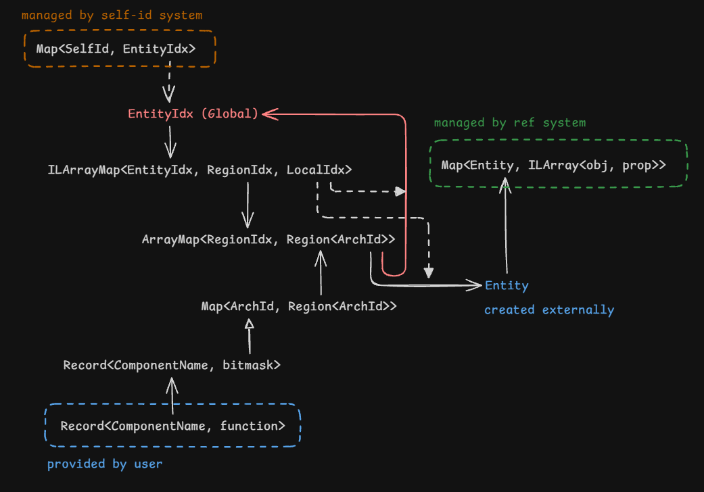

# Ecstasy [WIP]

A low-level ECS library that leans into what is fast for the engine

```sh
# install dependencies
bun install
# testing
bun test
# building
bun build src/index --outdir dist --minify
```

> [!NOTE] The library uses some relatively new features such as `Iterator.prototype.toArray` and `Map.prototype.getOrInsert`

## Design

TODO



## Limitations

- `selfId`s cannot be `undefined`
- Components cannot be named anything in the Object prototype chain (e.g. `toString`, `hasOwnProperty`, etc.)
- Cannot dynamically register new components to the ecs

## Optimization & Performance

As with any optimization, I have to assume a few things. If these assumptions don't apply to you, well, benchmark and compare with other libaries. However, I feel this is generic for all ECS.

- There are a limited number of queries and systems and they mostly stay static during the lifetime of the application
- Most archetypes are mutually exclusive (i.e. $a << 2^c$ where c is the number of components and a is the number of archetypes used)
- Entities are less likely to be looked up by ID than iterated over by systems
- Iteration by systems outweigh entity creation and deletion

As such, Ecstasy works best when there are many entities where there are groups of distict entities and the lifetime of an entity is long.

Unlike some other libraries, Ecstasy does not have a way to eliminate dead archetypes. This means that with enough dynamic archetypes (e.g. 20), memory usage and performance will degrade. To mitigate this, assign `null` to components that are no longer in use instead of removing them from the entity, and filter them out in the system.

## Comparison with other libraries

TODO

## Query system

You have two flavors:
- `query` for a concise, composable, javascript style api, that internally generates and caches optimized queries
- `Query` for an OOP oriented instantiated query object that can be reused

TODO

## Autoflush

If autoflush is disabled, entity add/remove operations will not be reflected until flush is called. If enabled, queries will automatically run all pending operations after finishing iteration

## Example

TODO
